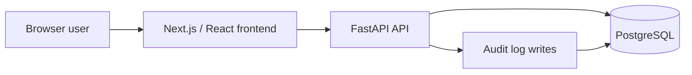

# Workflow Approval Engine

Production-style end-to-end workflow approval platform built with FastAPI, PostgreSQL, Next.js, Docker, Prometheus, and Grafana. The application enforces workflow state transitions using a finite-state machine (FSM), maintains a transactional audit trail, and exposes production-style observability through Prometheus metrics and Grafana dashboards.

## Resume Highlights

- Built a production-style end-to-end workflow approval platform using FastAPI, PostgreSQL, Next.js, React, TypeScript, Docker Compose, Prometheus, and Grafana.
- Implemented a finite-state machine (FSM) to enforce legal workflow transitions with HTTP 409 responses for invalid state changes.
- Guaranteed transactional consistency by writing workflow state updates and audit logs atomically within a single database transaction.
- Instrumented the application with Prometheus business metrics and Grafana dashboards for workflow creation, state transitions, latency, throughput, and process metrics.
- Benchmarked concurrent workflow lifecycles using a custom asynchronous benchmarking tool and documented throughput, latency, and error-rate characteristics.
- Configured GitHub Actions CI for backend testing and frontend lint/build validation.

## Quick Start

Run the full stack:

```bash
docker compose up -d --build
```

Default service URLs:

| Service | URL |
| --- | --- |
| Frontend | http://localhost:3000 |
| API | http://localhost:8000 |
| API docs | http://localhost:8000/docs |
| PostgreSQL | localhost:5432 |

If local ports are already in use:

```bash
API_PORT=18080 FRONTEND_PORT=13000 POSTGRES_PORT=15432 \
NEXT_PUBLIC_API_URL=http://localhost:18080 \
docker compose up -d --build
```

Alternate URLs used during verification:

| Service | URL |
| --- | --- |
| Frontend | http://localhost:13000 |
| API | http://localhost:18080 |
| PostgreSQL | localhost:15432 |

## Architecture



## Tech Stack

| Layer | Technologies |
| --- | --- |
| Backend | Python, FastAPI, SQLAlchemy, Pydantic, Uvicorn |
| Frontend | Next.js, React, TypeScript, Tailwind CSS |
| Database | PostgreSQL |
| Infrastructure | Docker, Docker Compose |
| CI | GitHub Actions |
| Testing | pytest, FastAPI TestClient |
| Observability | Prometheus, Grafana |

## Workflow Model

Allowed state transitions:

```text
PENDING -> APPROVED
PENDING -> REJECTED
```

Every workflow create and transition writes an audit log entry. Invalid transitions return an error instead of changing state.

## API Endpoints

| Method | Endpoint | Description |
| --- | --- | --- |
| `GET` | `/health` | Health check |
| `POST` | `/workflows` | Create workflow |
| `GET` | `/workflows` | List workflows, optionally filtered by `state` |
| `GET` | `/workflows/{id}` | Workflow detail with audit history |
| `POST` | `/workflows/{id}/approve` | Approve pending workflow |
| `POST` | `/workflows/{id}/reject` | Reject pending workflow |

## Testing

Run backend tests:

```bash
python -m pytest tests -v
```

Previously verified result:

```text
13 passed
```

Run frontend checks:

```bash
cd frontend
npm run lint
npm run build
```

GitHub Actions runs backend tests plus frontend lint/build on push and pull request.

## Benchmarks

Benchmark tooling:

```bash
python scripts/benchmark_api.py --base-url http://localhost:18080 --workflows 120 --concurrency 12 --warmup 12
```

Docker-network benchmark command:

```bash
docker run --rm \
  --network workflow-approval-engine_default \
  -v "$PWD:/workspace" \
  -w /workspace \
  python:3.10-slim \
  python scripts/benchmark_api.py \
    --base-url http://app:8000 \
    --workflows 120 \
    --concurrency 12 \
    --warmup 12
```

Measured results are stored in [docs/metrics.md](docs/metrics.md).

| Metric | Result |
| --- | ---: |
| Cold start to healthy API | 17,496.36 ms |
| Steady-state throughput | 10.65 requests/sec |
| Error rate | 0.00% |
| All-request p50 latency | 1,013.51 ms |
| All-request p95 latency | 1,929.93 ms |
| Workflow creation p50 latency | 1,089.74 ms |
| Workflow approval p50 latency | 1,061.46 ms |
| Complete lifecycle p50 latency | 3,220.55 ms |
| Complete lifecycle p95 latency | 4,700.49 ms |

## Observability

Business metrics exposed through /metrics:

- workflow_created_total
- workflow_transition_total
- workflow_invalid_transition_total

Infrastructure metrics:

- HTTP request throughput
- HTTP request latency
- Memory usage
- Open file descriptors

| Service | URL |
| --- | --- |
| Prometheus | http://localhost:9090 |
| Grafana | http://localhost:3001 |

## Deployment

The project is deployable as Docker containers:

- `app`: FastAPI API service
- `frontend`: Next.js frontend service
- `db`: PostgreSQL service

Configuration is environment-driven. See [.env.example](.env.example) for database URL, CORS origins, public frontend API URL, internal Docker API URL, and port overrides.

No Kubernetes manifests are included in this repository.

## Demo / Screenshots

The running demo exposes:

- Dashboard and workflow list at the frontend URL.
- Workflow creation form.
- Workflow detail page with approve/reject actions.
- Audit history for create and transition events.
- Swagger API documentation at `/docs`.

Screenshots to include:

- Frontend dashboard
- Workflow detail page
- Swagger API documentation
- Prometheus metrics
- Grafana observability dashboard

## Local Development

Backend:

```bash
python -m venv venv
source venv/bin/activate
pip install -r requirements.txt
uvicorn app.main:app --reload --port 8000
```

Frontend:

```bash
cd frontend
cp .env.local.example .env.local
npm install
npm run dev
```

## Known Limitations

- Authentication and authorization are intentionally not implemented; the portfolio UI sends `owner_id` and `actor_id` as plain strings.
- Database schema is created on startup with SQLAlchemy metadata; production migrations such as Alembic are not included.
- Benchmarks were collected on a local Docker Desktop environment, so absolute latency will vary by machine.
- Benchmark runs create durable PostgreSQL records unless the database volume is reset.

## Failure Mode Validation

Failure mode tested: requests for nonexistent workflow IDs return HTTP 404 instead of silently succeeding or corrupting workflow state. The test suite covers this failure path alongside successful workflow creation, approval, filtering, and audit-log validation.
